# Zero Ecotope Framework

[](https://mvnrepository.com/artifact/io.zerows/rachel-momo)  [](https://mvnrepository.com/artifact/io.zerows/r2mo-rapid)
Zero Waiting

> For Rachel Momo

## 0. 引导

目前未发布正式版本，等手中项目全部迁移完成之后会发布 `1.0.0`
正式版本，有兴趣的朋友可以参与测试，测试项目地址：<https://gitee.com/zero-ws/zero-rachel-momo>。

### 0.1. 主页信息

- （后端）Zero Ecotope：<https://www.zerows.io>
- （前端）Zero UI：<https://www.vertxui.cn>
- （工具）Zero AI：<https://www.vertxai.cn>
- （标准）Zero Schema：<https://www.vertx-cloud.cn>

### 0.2. 新版说明

- 为兼容 Spring Boot 开发人员和 Vert.x
  开发人员，重新设计底层抽象框架：[Rapid R2MO](https://gitee.com/silentbalanceyh/r2mo-rapid)。
- 提供两套原生结构专注于 Spring / Vert.x 开发，若只是想要短平快地开发、实施、交付中小项目，可考虑使用。
-
配置管理分为：本地配置和远程配置（Nacos），配置结构参考：[vertx.yml](https://gitee.com/zero-ws/zero-rachel-momo/blob/master/rachel-momo-app/app-zero-extension/src/main/resources/vertx.yml)
，本次重构的配置结构契合 Spring Boot 中的
`application.yml` 结构，方便快速上手。
- 提供 `HActor` 插件/模块 启动器，近似于 `-starter` 模型，更方便扩展开发。
- 提供快速脚手架初始化工具：[Zero Ai](https://www.vertxai.cn)。
- 让 Spring 和 Vert.x（Zero）可无缝实现基于 Dubbo 的微服务通信。

### 0.3. 场景说明

| 场景类型     | 后端                                                                | 前端                                                     |
|----------|-------------------------------------------------------------------|--------------------------------------------------------|
| 管理密集型    | [R2MO Rapid Spring](https://gitee.com/silentbalanceyh/r2mo-rapid) | [Zero Ui](https://www.vertxui.cn/)                     |
| 运算、交互密集型 | [Zero Epoch](https://www.zerows.io/)                              | [R2MO Web](https://gitee.com/silentbalanceyh/r2mo-web) |                       

> 精力有限，Vert.x 本在国内属于小众，无法提供更多关于 Zero 的测评数据，现阶段只在部分项目、公司产品研发中使用。

---

## 1. 模块依赖

### 1.1. 源文件

- [整体依赖图](docs/dependency.md)
- [R2MO依赖图](docs/dependency-r2mo-compile.md)
- [ZERO依赖图](docs/dependency-zero-compile.md)

### 1.2. ZERO



### 1.3. R2MO & ZERO



---

## 1. 快速开始

### 1.1. 简化用法

```java
package io.zerows.momo.app;

import io.zerows.boot.VertxApplication;
import io.zerows.epoch.annotations.Up;

@Up
public class BasicApplication {
    // 无配置模式可直接启动
    public static void main(final String[] args) {
        VertxApplication.run(BasicApplication.class, args);
    }
}
```

### 1.2. 参考案例

地址：<https://gitee.com/zero-ws/zero-rachel-momo>

项目结构：

- 📚️ 应用案例（ `app-rachel-momo` ）：
    - [x] ☘️ `app-spring-example`
        - [x] ☘️ `app-spring-auth`：Spring 安全认证专用 Demo。
        - [x] ☘️ `app-spring-test`：Spring 基础应用 Demo。
    - [x] 🍓 `app-vertx-example`
        - [x] 🍓 `app-vertx-rapid`：Vert.x 基础应用。
    - [x] 🧊 `app-zero-example`
        - [x] 🧊 `app-zero-basic`：Zero Core 最小化应用。
        - [x] 🧊 `app-zero-extension`：Zero Extension 扩展应用（带业务模块）。
        - [x] 🧊 `app-zero-module`：Zero 自定义模块化开发，扩展模块。
        - [x] 🧊 `app-zero-service`：Zero 微服务应用。
    - [x] 🐣 `app-unit-example`：公共模块。
        - [x] 🐣 `unit-zero-common`：单元测试基础
        - [x] 🐣 `unit-zero-config-l`：本地配置测试
        - [x] 🐣 `unit-zero-config-r`：远程配置（Nacos）测试

### 1.3. 项目初始化

最新版：

```bash
# 安装自动化工具
npm install -g zero-ai

# 初始化 Spring 项目脚手架
ai spring -n app-spring
# 初始化 Zero 项目脚手架（开发中）
ai app -n app-zero
```

- Windows 版本还在开发中。
- Spring 脚手架只是基于 R2MO Rapid 的快速初始化，和 Zero 无关。

### 1.4. Zero Extension 接口

地址：<https://zerows.apifox.cn/>

#### 属性标记

| 属性标记 | 说明                                              |
|------|-------------------------------------------------|
| 🥏   | Java 组件属性，一般映射成 Java 类名                         |
| 🧫   | 配置专用属性，通常对应 `JsonObject / JsonArray` 数据结构       |
| 🧊   | 业务属性，此属性一般呈现于界面提供给用户使用                          |
| 🔑   | 标识属性，可标识当前数据记录，标识属性不包含范围如 `APP_ID / TENANT_ID`等 |
| 🧬   | 范围标识符，用于标记所属范围                                  |
| 🔨   | 系统属性，通常为系统自动属性，部署运维专用                           |
| 🫆   | Audit 属性，通常为 `?At / ?By`                        |
| ☘️   | 关联属性                                            |
| 🔵   | （后缀）布尔值，Json格式                                  |
| 🔴   | （后缀）数值，Json格式                                   |

#### 时序图标记

- 🧪 ：Agent / Worker 基本方法
- 🟧：EventBus 地址
- 🧬：业务逻辑方法
- 🪼：数据库 DBE方法
- 🧩：组件 / 插件 / SPI专用逻辑

## 2. 相关文档

### 2.1. 相关链接

版本比较旧，新版可直接参考测试项目中的 Demo。

| 项                                                                      | 说明                                                                                                         |
|------------------------------------------------------------------------|:-----------------------------------------------------------------------------------------------------------|
| [Zero Ui](https://www.vertxui.cn)                                      | Zero Ui：基于 `React` 和 `Ant Design (Pro/g2/g6)` 的前端框架。                                                       |
| [Zero Ai](https://www.vertxai.cn)                                      | Zero Ai：快速开发常用脚本工具箱、代码生成、数据生成、模拟请求等                                                                        |
| [Zero Docs (英文)](https://onemsg.github.io/vertx-zero/)                 | 热心网友提供的一份在线文档：[onemsg](https://github.com/onemsg), 作者BLOG <https://juejin.cn/user/3597257778669592/posts>. |
| [Zero代码示例](https://github.com/silentbalanceyh/vertx-zero-example)      | 旧版本常用的Zero在线代码示例。                                                                                          |
| [旧版英文文档](DOCUMENT.md)                                                  | 旧版 `0.4.8` 文档（英文）。                                                                                         |
| [《Zero冥思录》](https://lang-yu.gitbook.io/zero/)                          | 中文版标准Zero引导教程（总19章）。                                                                                       |
| [《Vert.x逐陆记》](https://lang-yu.gitbook.io/vert-x/)                      | 中文版Vert.x教程 ( In Progress，我很懒，只有前三章 )                                                                      |
| [《Zero云平台白皮书》](https://www.vertx-cloud.cn/document/doc-web/index.html) | 开发实施手册：扩展模块、前端、云端、工具的工程化白皮书。                                                                               |

### 2.2. 微信群

使用: `445191171` 加作者微信，拉群.


## DESIGNED IN CHINA（中国设计）


