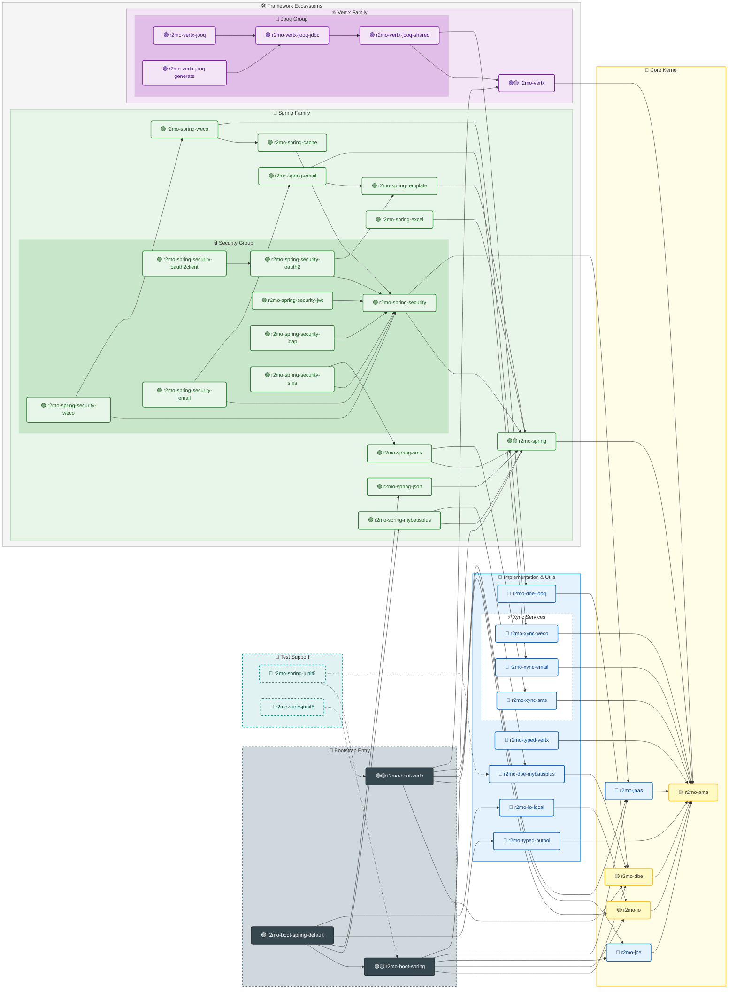

```mermaid
graph LR
    %% =========================================================================
    %% [全局样式配置]
    %% =========================================================================
    linkStyle default interpolate basis
    
    %% 定义颜色风格 (对应 Emoji 颜色)
    classDef style_core fill:#fff9c4,stroke:#fbc02d,stroke-width:2px,rx:5,ry:5,color:#333
    classDef style_green fill:#e8f5e9,stroke:#2e7d32,stroke-width:2px,rx:5,ry:5,color:#1b5e20
    classDef style_purple fill:#f3e5f5,stroke:#7b1fa2,stroke-width:2px,rx:5,ry:5,color:#4a148c
    classDef style_blue fill:#e3f2fd,stroke:#1565c0,stroke-width:2px,rx:5,ry:5,color:#0d47a1
    classDef style_boot fill:#37474f,stroke:#263238,stroke-width:2px,rx:5,ry:5,color:#fff
    %% 虚线样式的兼容写法：stroke-dasharray: 5,5
    classDef style_test fill:#e0f2f1,stroke:#009688,stroke-width:2px,rx:5,ry:5,stroke-dasharray: 5,5,color:#004d40

    %% =========================================================================
    %% [第一层：Boot 启动与入口]
    %% =========================================================================
    subgraph Layer_Boot ["🚀 Bootstrap Entry"]
        direction TB
        r-boot-spring-default["🟢 r2mo-boot-spring-default"]:::style_boot
        r-boot-spring["🟢🟡 r2mo-boot-spring"]:::style_boot
        r-boot-vertx["🟣🟡 r2mo-boot-vertx"]:::style_boot
    end

    %% =========================================================================
    %% [独立隔离层：Test 测试支持]
    %% =========================================================================
    subgraph Layer_Test ["🧪 Test Support"]
        direction TB
        r-spring-junit5["🧪 r2mo-spring-junit5"]:::style_test
        r-vertx-junit5["🧪 r2mo-vertx-junit5"]:::style_test
    end

    %% =========================================================================
    %% [第二层：Framework 框架生态]
    %% =========================================================================
    subgraph Layer_Framework ["🛠 Framework Ecosystems"]
        direction TB

        %% --- Spring 家族 ---
        subgraph Box_Spring ["🍃 Spring Family"]
            direction TB
            r-spring["🟢🟡 r2mo-spring"]:::style_green
            
            %% Security 组
            subgraph Box_Security ["🔒 Security Group"]
                r-spring-security["🟢 r2mo-spring-security"]:::style_green
                r-spring-security-oauth2client["🟢 r2mo-spring-security-oauth2client"]:::style_green
                r-spring-security-oauth2["🟢 r2mo-spring-security-oauth2"]:::style_green
                r-spring-security-jwt["🟢 r2mo-spring-security-jwt"]:::style_green
                r-spring-security-ldap["🟢 r2mo-spring-security-ldap"]:::style_green
                
                r-spring-security-email["🟢 r2mo-spring-security-email"]:::style_green
                r-spring-security-sms["🟢 r2mo-spring-security-sms"]:::style_green
                r-spring-security-weco["🟢 r2mo-spring-security-weco"]:::style_green
            end
            
            %% 功能模块
            r-spring-mybatisplus["🟢 r2mo-spring-mybatisplus"]:::style_green
            r-spring-template["🟢 r2mo-spring-template"]:::style_green
            r-spring-excel["🟢 r2mo-spring-excel"]:::style_green
            r-spring-json["🟢 r2mo-spring-json"]:::style_green
            r-spring-cache["🟢 r2mo-spring-cache"]:::style_green
            
            %% 适配器
            r-spring-email["🟢 r2mo-spring-email"]:::style_green
            r-spring-sms["🟢 r2mo-spring-sms"]:::style_green
            r-spring-weco["🟢 r2mo-spring-weco"]:::style_green
        end

        %% --- Vert.x 家族 ---
        subgraph Box_Vertx ["⚛️ Vert.x Family"]
            direction TB
            r-vertx["🟣🟡 r2mo-vertx"]:::style_purple
            
            subgraph Box_Jooq ["🔮 Jooq Group"]
                r-vertx-jooq["🟣 r2mo-vertx-jooq"]:::style_purple
                r-vertx-jooq-generate["🟣 r2mo-vertx-jooq-generate"]:::style_purple
                r-vertx-jooq-jdbc["🟣 r2mo-vertx-jooq-jdbc"]:::style_purple
                r-vertx-jooq-shared["🟣 r2mo-vertx-jooq-shared"]:::style_purple
            end
        end
    end

    %% =========================================================================
    %% [第三层：Implementation 具体实现]
    %% =========================================================================
    subgraph Layer_Impl ["🔧 Implementation & Utils"]
        direction TB
        r-dbe-jooq["🔵 r2mo-dbe-jooq"]:::style_blue
        r-dbe-mybatisplus["🔵 r2mo-dbe-mybatisplus"]:::style_blue
        r-io-local["🔵 r2mo-io-local"]:::style_blue
        r-typed-hutool["🔵 r2mo-typed-hutool"]:::style_blue
        r-typed-vertx["🔵 r2mo-typed-vertx"]:::style_blue
        
        subgraph Box_Xync ["⚡ Xync Services"]
            r-xync-email["🔵 r2mo-xync-email"]:::style_blue
            r-xync-sms["🔵 r2mo-xync-sms"]:::style_blue
            r-xync-weco["🔵 r2mo-xync-weco"]:::style_blue
        end
    end

    %% =========================================================================
    %% [第四层：Kernel 核心基石]
    %% =========================================================================
    subgraph Layer_Kernel ["👑 Core Kernel"]
        direction TB
        r-ams["🟡 r2mo-ams"]:::style_core
        r-dbe["🟡 r2mo-dbe"]:::style_core
        r-io["🟡 r2mo-io"]:::style_core
        r-jaas["🔵 r2mo-jaas"]:::style_blue
        r-jce["🔵 r2mo-jce"]:::style_blue
    end

    %% =========================================================================
    %% [连线关系]
    %% =========================================================================

    %% Kernel
    r-dbe --> r-ams
    r-io --> r-ams
    r-jaas --> r-ams
    r-jce --> r-ams

    %% Impl -> Kernel
    r-dbe-jooq --> r-dbe
    r-dbe-mybatisplus --> r-dbe
    r-io-local --> r-io
    r-typed-hutool --> r-ams
    r-typed-vertx --> r-ams
    r-xync-email --> r-ams
    r-xync-sms --> r-ams
    r-xync-weco --> r-ams

    %% Framework -> Impl/Kernel
    r-spring --> r-ams
    r-spring-mybatisplus --> r-spring
    r-spring-mybatisplus --> r-dbe-mybatisplus
    r-spring-template --> r-spring
    r-spring-excel --> r-spring
    r-spring-json --> r-spring
    
    r-spring-email --> r-spring-template
    r-spring-email --> r-xync-email
    r-spring-sms --> r-spring
    r-spring-sms --> r-xync-sms
    r-spring-weco --> r-spring-cache
    r-spring-weco --> r-xync-weco

    r-spring-security --> r-spring
    r-spring-security --> r-jaas
    r-spring-cache --> r-spring-security
    r-spring-security-email --> r-spring-security
    r-spring-security-email --> r-spring-email
    r-spring-security-sms --> r-spring-security
    r-spring-security-sms --> r-spring-sms
    r-spring-security-weco --> r-spring-security
    r-spring-security-weco --> r-spring-weco
    r-spring-security-jwt --> r-spring-security
    r-spring-security-ldap --> r-spring-security
    r-spring-security-oauth2client --> r-spring-security-oauth2
    r-spring-security-oauth2 --> r-spring-security
    r-spring-security-oauth2 --> r-spring-template

    r-vertx --> r-ams
    r-vertx-jooq-generate --> r-vertx-jooq-jdbc
    r-vertx-jooq-jdbc --> r-vertx-jooq-shared
    r-vertx-jooq-shared --> r-vertx
    r-vertx-jooq-shared --> r-dbe-jooq
    r-vertx-jooq --> r-vertx-jooq-jdbc

    %% Boot
    r-boot-vertx --> r-dbe
    r-boot-vertx --> r-io
    r-boot-vertx --> r-jce
    r-boot-vertx --> r-jaas
    r-boot-vertx --> r-vertx

    r-boot-spring --> r-dbe
    r-boot-spring --> r-io
    r-boot-spring --> r-jce
    r-boot-spring --> r-jaas
    r-boot-spring --> r-spring

    r-boot-spring-default --> r-boot-spring
    r-boot-spring-default --> r-spring-mybatisplus
    r-boot-spring-default --> r-spring-json
    r-boot-spring-default --> r-typed-hutool
    r-boot-spring-default --> r-io-local

    %% --- Test 依赖连线 (使用虚线表示测试范围依赖) ---
    r-vertx-junit5 -.-> r-boot-vertx
    r-spring-junit5 -.-> r-boot-spring
    r-spring-junit5 -.-> r-dbe-mybatisplus

    %% =========================================================================
    %% [背景色块优化]
    %% =========================================================================
    style Layer_Kernel fill:#fffde7,stroke:#fbc02d,stroke-width:2px
    style Layer_Impl fill:#e3f2fd,stroke:#2196f3,stroke-width:2px
    style Layer_Framework fill:#f5f5f5,stroke:#bdbdbd,stroke-width:1px
    style Layer_Boot fill:#cfd8dc,stroke:#607d8b,stroke-width:2px,stroke-dasharray: 5,5
    style Layer_Test fill:#e0f2f1,stroke:#009688,stroke-width:2px,stroke-dasharray: 5,5

    style Box_Spring fill:#e8f5e9,stroke:#a5d6a7,stroke-width:1px
    style Box_Security fill:#c8e6c9,stroke:none
    style Box_Vertx fill:#f3e5f5,stroke:#ce93d8,stroke-width:1px
    style Box_Jooq fill:#e1bee7,stroke:none
    style Box_Xync fill:#ffffff,stroke:#90caf9,stroke-dasharray: 5,5
```