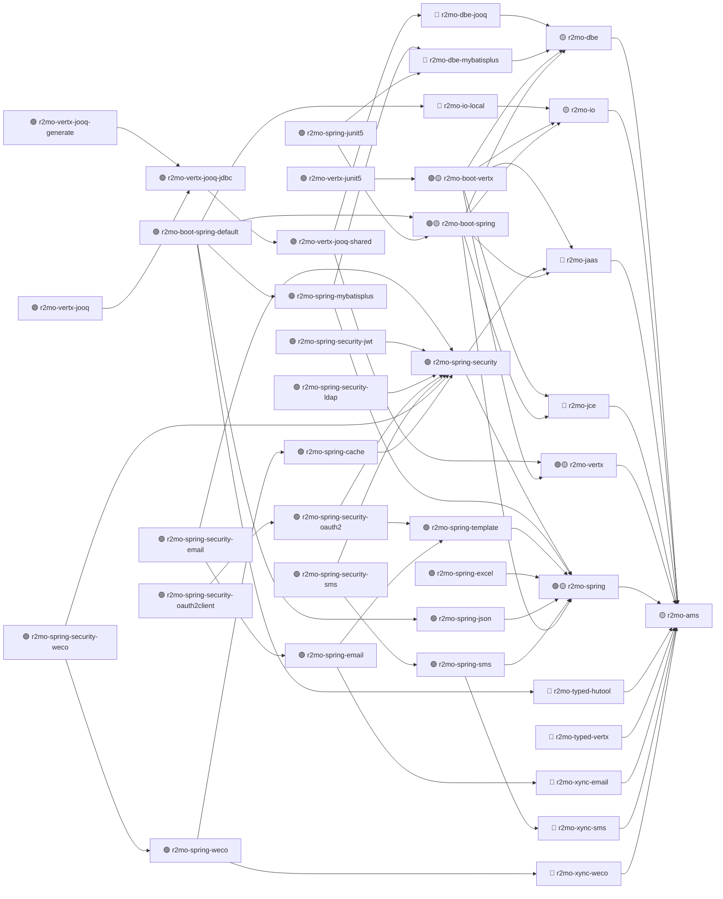

```mermaid
graph LR
  %% --- R2MO
  r-ams[🟡 r2mo-ams]
  r-boot-spring[🟢🟡 r2mo-boot-spring]
  r-boot-spring-default[🟢 r2mo-boot-spring-default]
  r-boot-vertx[🟣🟡 r2mo-boot-vertx]
  r-dbe[🟡 r2mo-dbe]
  r-dbe-jooq[🔵 r2mo-dbe-jooq]
  r-dbe-mybatisplus[🔵 r2mo-dbe-mybatisplus]
  r-io[🟡 r2mo-io]
  r-io-local[🔵 r2mo-io-local]
  r-jaas[🔵 r2mo-jaas]
  r-jce[🔵 r2mo-jce]
  r-spring[🟢🟡 r2mo-spring]
  r-spring-cache[🟢 r2mo-spring-cache]
  r-spring-email[🟢 r2mo-spring-email]
  r-spring-excel[🟢 r2mo-spring-excel]
  r-spring-json[🟢 r2mo-spring-json]
  r-spring-junit5[🟢 r2mo-spring-junit5]
  r-spring-mybatisplus[🟢 r2mo-spring-mybatisplus]
  r-spring-security[🟢 r2mo-spring-security]
  r-spring-security-email[🟢 r2mo-spring-security-email]
  r-spring-security-jwt[🟢 r2mo-spring-security-jwt]
  r-spring-security-ldap[🟢 r2mo-spring-security-ldap]
  r-spring-security-oauth2[🟢 r2mo-spring-security-oauth2]
  r-spring-security-oauth2client[🟢 r2mo-spring-security-oauth2client]
  r-spring-security-sms[🟢 r2mo-spring-security-sms]
  r-spring-security-weco[🟢 r2mo-spring-security-weco]
  r-spring-sms[🟢 r2mo-spring-sms]
  r-spring-template[🟢 r2mo-spring-template]
  r-spring-weco[🟢 r2mo-spring-weco]
  r-typed-hutool[🔵 r2mo-typed-hutool]
  r-typed-vertx[🔵 r2mo-typed-vertx]
  r-vertx[🟣🟡 r2mo-vertx]
  r-vertx-jooq[🟣 r2mo-vertx-jooq]
  r-vertx-jooq-generate[🟣 r2mo-vertx-jooq-generate]
  r-vertx-jooq-jdbc[🟣 r2mo-vertx-jooq-jdbc]
  r-vertx-jooq-shared[🟣 r2mo-vertx-jooq-shared]
  r-vertx-junit5[🟣 r2mo-vertx-junit5]
  r-xync-email[🔵 r2mo-xync-email]
  r-xync-sms[🔵 r2mo-xync-sms]
  r-xync-weco[🔵 r2mo-xync-weco]
  
  %% --- 抽象 @ 抽象
  %% --- DBE
  r-dbe --> r-ams
  r-dbe-jooq & r-dbe-mybatisplus --> r-dbe
  
  %% --- IO
  r-io --> r-ams
  r-io-local --> r-io
  
  r-jaas --> r-ams
  r-jce --> r-ams
  
  %% --- Vertx
  r-vertx --> r-ams
  r-vertx-jooq-generate --> r-vertx-jooq-jdbc --> r-vertx-jooq-shared --> r-vertx & r-dbe-jooq
  r-vertx-jooq --> r-vertx-jooq-jdbc
  
  r-boot-vertx --> r-dbe & r-io & r-jce & r-jaas & r-vertx
  r-vertx-junit5 --> r-boot-vertx
  
  %% --- Spring
  r-spring --> r-ams
  
  r-spring-security --> r-spring & r-jaas
  r-spring-security-email --> r-spring-security & r-spring-email
  r-spring-security-jwt --> r-spring-security
  r-spring-security-ldap --> r-spring-security
  r-spring-security-oauth2 --> r-spring-security & r-spring-template
  r-spring-security-oauth2client --> r-spring-security-oauth2
  r-spring-security-sms --> r-spring-security & r-spring-sms
  r-spring-security-weco --> r-spring-security & r-spring-weco
  
  r-spring-mybatisplus --> r-spring & r-dbe-mybatisplus
  r-spring-template & r-spring-excel & r-spring-json --> r-spring
  r-spring-cache --> r-spring-security
  
  r-spring-email --> r-spring-template & r-xync-email
  r-spring-sms --> r-spring & r-xync-sms
  r-spring-weco --> r-spring-cache & r-xync-weco
  
  r-boot-spring --> r-dbe & r-io & r-jce & r-jaas & r-spring
  r-boot-spring-default --> r-boot-spring & r-spring-mybatisplus & r-spring-json & r-typed-hutool & r-io-local
  
  r-spring-junit5 --> r-boot-spring & r-dbe-mybatisplus
  
  %% --------------------------------------------
  %% --- 实现 @ 抽象
  %% --- Typed
  r-typed-hutool & r-typed-vertx --> r-ams
  
  %% --- Xync
  r-xync-email & r-xync-sms & r-xync-weco --> r-ams
```