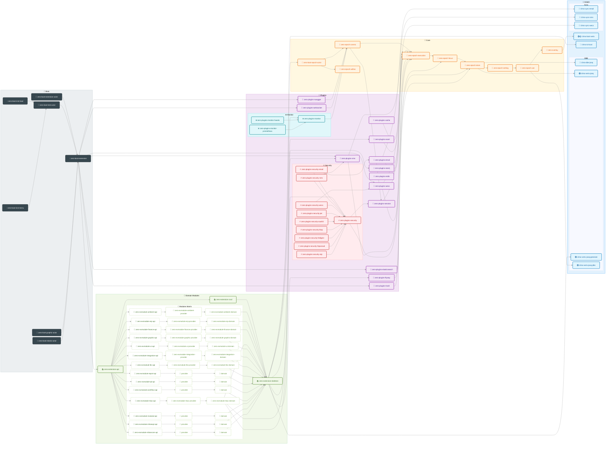

```mermaid
%%{init: {
  'theme': 'base',
  'themeVariables': { 'fontSize': '13px', 'fontFamily': 'arial', 'darkMode': false },
  'flowchart': { 
    'diagramPadding': 5, 
    'nodeSpacing': 10, 
    'rankSpacing': 25, 
    'curve': 'basis', 
    'useMaxWidth': true
  }
} }%%
graph LR
    %% =========================================================================
    %% [样式定义]
    %% =========================================================================
    linkStyle default interpolate basis stroke:#999,stroke-width:1px
    
    classDef cls_r2mo fill:#e1f5fe,stroke:#0277bd,stroke-width:2px,rx:4,ry:4,color:#01579b
    classDef cls_core fill:#fff3e0,stroke:#ef6c00,stroke-width:2px,rx:4,ry:4,color:#e65100
    classDef cls_plugin fill:#f3e5f5,stroke:#8e24aa,stroke-width:2px,rx:4,ry:4,color:#4a148c
    classDef cls_sec fill:#ffebee,stroke:#c62828,stroke-width:2px,rx:4,ry:4,color:#b71c1c
    classDef cls_monitor fill:#e0f7fa,stroke:#00838f,stroke-width:2px,rx:4,ry:4,color:#006064
    classDef cls_ext fill:#f1f8e9,stroke:#558b2f,stroke-width:2px,rx:4,ry:4,color:#33691e
    %% 模块简化样式: 虚线边框+纯白背景，减少视觉重量
    classDef cls_mod_api fill:#fff,stroke:#7cb342,stroke-width:1px,rx:3,ry:3,color:#33691e,stroke-dasharray: 2 2
    classDef cls_mod_node fill:#fff,stroke:#aed581,stroke-width:1px,rx:3,ry:3,color:#558b2f
    classDef cls_boot fill:#37474f,stroke:#263238,stroke-width:2px,rx:4,ry:4,color:#fff

    %% =========================================================================
    %% [Zone 1] Boot Entry (垂直堆叠)
    %% =========================================================================
    subgraph Zone_Boot ["🚀 Boot"]
        direction TB
        z-boot-extension["💧 zero-boot-extension"]:::cls_boot
        z-boot-extension-actor["🪼 zero-boot-extension-actor"]:::cls_boot
        z-boot-test-actor["🪼 zero-boot-test-actor"]:::cls_boot
        z-boot-graphic-actor["🪼 zero-boot-graphic-actor"]:::cls_boot
        z-boot-elastic-actor["🪼 zero-boot-elastic-actor"]:::cls_boot
        z-boot-inst-load["💧 zero-boot-inst-load"]:::cls_boot
        z-boot-inst-menu["💧 zero-boot-inst-menu"]:::cls_boot
    end

    %% =========================================================================
    %% [Zone 2] Extensions (紧凑矩阵)
    %% =========================================================================
    subgraph Zone_Extension ["🌿 Domain Modules"]
        direction TB
        
        %% 入口 API
        z-extension-api["📚️ zero-extension-api"]:::cls_ext
        z-extension-crud["📚️ zero-extension-crud"]:::cls_ext
        
        %% 模块矩阵: 移除内部子图，让链条自动垂直紧凑排列
        subgraph Matrix_Modules ["🧪 Modules Matrix"]
            direction TB
            
            %% --- 核心组 ---
            za_a["🧪 zero-exmodule-ambient-api"]:::cls_mod_api --> za_p["🧪 zero-exmodule-ambient-provider"]:::cls_mod_node --> za_d["🧪 zero-exmodule-ambient-domain"]:::cls_mod_node
            ze_a["🧪 zero-exmodule-erp-api"]:::cls_mod_api --> ze_p["🧪 zero-exmodule-erp-provider"]:::cls_mod_node --> ze_d["🧪 zero-exmodule-erp-domain"]:::cls_mod_node
            zf_a["🧪 zero-exmodule-finance-api"]:::cls_mod_api --> zf_p["🧪 zero-exmodule-finance-provider"]:::cls_mod_node --> zf_d["🧪 zero-exmodule-finance-domain"]:::cls_mod_node
            zr_a["🧪 zero-exmodule-rbac-api"]:::cls_mod_api --> zr_p["🧪 zero-exmodule-rbac-provider"]:::cls_mod_node --> zr_d["🧪 zero-exmodule-rbac-domain"]:::cls_mod_node
            
            %% --- 功能组 ---
            zg_a["🧪 zero-exmodule-graphic-api"]:::cls_mod_api --> zg_p["🧪 zero-exmodule-graphic-provider"]:::cls_mod_node --> zg_d["🧪 zero-exmodule-graphic-domain"]:::cls_mod_node
            zu_a["🧪 zero-exmodule-ui-api"]:::cls_mod_api --> zu_p["🧪 zero-exmodule-ui-provider"]:::cls_mod_node --> zu_d["🧪 zero-exmodule-ui-domain"]:::cls_mod_node
            zi_a["🧪 zero-exmodule-integration-api"]:::cls_mod_api --> zi_p["🧪 zero-exmodule-integration-provider"]:::cls_mod_node --> zi_d["🧪 zero-exmodule-integration-domain"]:::cls_mod_node
            zl_a["🧪 zero-exmodule-lbs-api"]:::cls_mod_api --> zl_p["🧪 zero-exmodule-lbs-provider"]:::cls_mod_node --> zl_d["🧪 zero-exmodule-lbs-domain"]:::cls_mod_node
            
            %% --- 系统组 ---
            zrep_a["🧪 zero-exmodule-report-api"]:::cls_mod_api --> zrep_p["🧪 provider"]:::cls_mod_node --> zrep_d["🧪 domain"]:::cls_mod_node
            ztpl_a["🧪 zero-exmodule-tpl-api"]:::cls_mod_api --> ztpl_p["🧪 provider"]:::cls_mod_node --> ztpl_d["🧪 domain"]:::cls_mod_node
            zwf_a["🧪 zero-exmodule-workflow-api"]:::cls_mod_api --> zwf_p["🧪 provider"]:::cls_mod_node --> zwf_d["🧪 domain"]:::cls_mod_node
            zmd_a["🧪 zero-exmodule-modulat-api"]:::cls_mod_api --> zmd_p["🧪 provider"]:::cls_mod_node --> zmd_d["🧪 domain"]:::cls_mod_node
            
            %% --- MBSE ---
            zma_a["🧪 zero-exmodule-mbseapi-api"]:::cls_mod_api --> zma_p["🧪 provider"]:::cls_mod_node --> zma_d["🧪 domain"]:::cls_mod_node
            zmc_a["🧪 zero-exmodule-mbsecore-api"]:::cls_mod_api --> zmc_p["🧪 provider"]:::cls_mod_node --> zmc_d["🧪 domain"]:::cls_mod_node
        end

        z-extension-skeleton["📚️ zero-extension-skeleton"]:::cls_ext
    end

    %% =========================================================================
    %% [Zone 3] Plugins
    %% =========================================================================
    subgraph Zone_Plugins ["🧩 Plugins"]
        direction TB
        
        %% 将标准插件分为两组以平衡高度
        z-plugins-cache["🧩 zero-plugins-cache"]:::cls_plugin
        z-plugins-session["🧩 zero-plugins-session"]:::cls_plugin
        z-plugins-flyway["🧩 zero-plugins-flyway"]:::cls_plugin
        z-plugins-excel["🧩 zero-plugins-excel"]:::cls_plugin
        z-plugins-redis["🧩 zero-plugins-redis"]:::cls_plugin
        z-plugins-elasticsearch["🧩 zero-plugins-elasticsearch"]:::cls_plugin
        z-plugins-neo4j["🧩 zero-plugins-neo4j"]:::cls_plugin
        z-plugins-trash["🧩 zero-plugins-trash"]:::cls_plugin
        z-plugins-swagger["🧩 zero-plugins-swagger"]:::cls_plugin
        z-plugins-websocket["🧩 zero-plugins-websocket"]:::cls_plugin

        z-plugins-email["🧩 zero-plugins-email"]:::cls_plugin
        z-plugins-sms["🧩 zero-plugins-sms"]:::cls_plugin
        z-plugins-weco["🧩 zero-plugins-weco"]:::cls_plugin

        subgraph Box_Security ["🔥 Security"]
            z-plugins-security["🔥 zero-plugins-security"]:::cls_sec
            z-plugins-security-email["🔥 zero-plugins-security-email"]:::cls_sec
            z-plugins-security-sms["🔥 zero-plugins-security-sms"]:::cls_sec
            z-plugins-security-weco["🔥 zero-plugins-security-weco"]:::cls_sec
            z-plugins-security-jwt["🔥 zero-plugins-security-jwt"]:::cls_sec
            z-plugins-security-oauth2["🔥 zero-plugins-security-oauth2"]:::cls_sec
            z-plugins-security-ldap["🔥 zero-plugins-security-ldap"]:::cls_sec
            z-plugins-security-htdigest["🔥 zero-plugins-security-htdigest"]:::cls_sec
            z-plugins-security-htpasswd["🔥 zero-plugins-security-htpasswd"]:::cls_sec
            z-plugins-security-otp["🔥 zero-plugins-security-otp"]:::cls_sec
        end

        subgraph Box_Monitor ["❄️ Monitor"]
            z-plugins-monitor["❄️ zero-plugins-monitor"]:::cls_monitor
            z-plugins-monitor-hawtio["❄️ zero-plugins-monitor-hawtio"]:::cls_monitor
            z-plugins-monitor-prometheus["❄️ zero-plugins-monitor-prometheus"]:::cls_monitor
        end
    end

    %% =========================================================================
    %% [Zone 4] Core
    %% =========================================================================
    subgraph Zone_Core ["👑 Core"]
        direction TB
        z-overlay["🧬 zero-overlay"]:::cls_core
        z-epoch-use["🧬 zero-epoch-use"]:::cls_core
        z-epoch-setting["🧬 zero-epoch-setting"]:::cls_core
        z-epoch-store["🧬 zero-epoch-store"]:::cls_core
        z-epoch-focus["🧬 zero-epoch-focus"]:::cls_core
        z-epoch-execution["🧬 zero-epoch-execution"]:::cls_core
        z-epoch-cosmic["🧬 zero-epoch-cosmic"]:::cls_core
        z-epoch-adhoc["🧬 zero-epoch-adhoc"]:::cls_core
        z-boot-epoch-actor["🪼 zero-boot-epoch-actor"]:::cls_core
    end

    %% =========================================================================
    %% [Zone 5] R2MO
    %% =========================================================================
    subgraph Zone_R2MO ["🔷 R2MO"]
        direction TB
        r-boot-vertx["🟣🟡 r2mo-boot-vertx"]:::cls_r2mo
        r-io-local["🔵 r2mo-io-local"]:::cls_r2mo
        
        subgraph Box_DBE ["DBE"]
            r-dbe-jooq["🔵 r2mo-dbe-jooq"]:::cls_r2mo
            r-vertx-jooq["🟣 r2mo-vertx-jooq"]:::cls_r2mo
            r-vertx-jooq-generate["🟣 r2mo-vertx-jooq-generate"]:::cls_r2mo
            r-vertx-jooq-jdbc["🟣 r2mo-vertx-jooq-jdbc"]:::cls_r2mo
        end
        
        subgraph Box_Xync ["Xync"]
            r-xync-email["🔵 r2mo-xync-email"]:::cls_r2mo
            r-xync-sms["🔵 r2mo-xync-sms"]:::cls_r2mo
            r-xync-weco["🔵 r2mo-xync-weco"]:::cls_r2mo
        end
    end

    %% =========================================================================
    %% [连线]
    %% =========================================================================
    
    z-boot-extension --> z-extension-api
    z-boot-extension --> z-plugins-swagger & z-plugins-trash & z-plugins-websocket
    z-boot-extension --> z-plugins-sms & z-plugins-weco & z-plugins-elasticsearch
    
    z-boot-extension-actor --> z-boot-extension
    z-boot-test-actor & z-boot-graphic-actor & z-boot-elastic-actor --> z-boot-extension
    z-boot-inst-load & z-boot-inst-menu --> z-boot-test-actor

    z-extension-api --> z-extension-crud --> z-extension-skeleton
    
    z-extension-api --> za_a & ze_a & zf_a & zr_a & zg_a & zu_a & zi_a & zl_a & zrep_a & ztpl_a & zwf_a & zmd_a & zma_a & zmc_a
    za_d & ze_d & zf_d & zr_d & zg_d & zu_d & zi_d & zl_d & zrep_d & ztpl_d & zwf_d & zmd_d & zma_d & zmc_d --> z-extension-skeleton
    
    zr_d --> z-plugins-security & z-plugins-sms

    z-extension-skeleton --> z-boot-epoch-actor
    z-extension-skeleton --> r-io-local & r-vertx-jooq-generate
    z-extension-skeleton --> z-plugins-excel & z-plugins-monitor & z-plugins-flyway & z-plugins-neo4j

    z-boot-epoch-actor --> z-epoch-cosmic & z-epoch-adhoc
    z-epoch-cosmic --> z-epoch-execution & z-plugins-session
    z-epoch-execution --> z-epoch-focus
    z-epoch-focus --> z-epoch-store
    z-epoch-store --> z-epoch-setting
    z-epoch-setting --> z-epoch-use
    z-epoch-use --> z-overlay
    z-epoch-store --> r-vertx-jooq & r-dbe-jooq
    
    z-overlay --> r-boot-vertx
    z-epoch-use --> r-vertx-jooq-jdbc

    z-plugins-cache & z-plugins-excel & z-plugins-neo4j & z-plugins-redis & z-plugins-session --> z-epoch-execution
    z-plugins-elasticsearch --> z-epoch-focus
    z-plugins-flyway & z-plugins-trash --> z-epoch-store
    z-plugins-swagger & z-plugins-websocket & z-plugins-monitor --> z-epoch-cosmic
    z-plugins-monitor-hawtio & z-plugins-monitor-prometheus --> z-plugins-monitor

    z-plugins-email --> z-epoch-execution & r-xync-email
    z-plugins-sms --> z-epoch-execution & r-xync-sms
    z-plugins-weco --> z-epoch-execution & r-xync-weco
    
    z-plugins-security --> z-epoch-execution & z-plugins-session
    z-plugins-security-email --> z-plugins-email & z-plugins-security
    z-plugins-security-sms --> z-plugins-sms & z-plugins-security
    z-plugins-security-weco --> z-plugins-weco & z-plugins-security
    z-plugins-security-jwt & z-plugins-security-oauth2 & z-plugins-security-ldap --> z-plugins-security
    z-plugins-security-htdigest & z-plugins-security-htpasswd & z-plugins-security-otp --> z-plugins-security

    %% =========================================================================
    %% [背景色块]
    %% =========================================================================
    style Zone_Boot fill:#eceff1,stroke:#cfd8dc,stroke-width:2px
    style Zone_Extension fill:#f1f8e9,stroke:#c8e6c9,stroke-width:2px
    style Zone_Plugins fill:#f3e5f5,stroke:#e1bee7,stroke-width:2px
    style Zone_Core fill:#fff8e1,stroke:#ffe0b2,stroke-width:2px
    style Zone_R2MO fill:#e3f2fd,stroke:#90caf9,stroke-width:2px
    
    style Matrix_Modules fill:#ffffff,stroke:#dcedc8,stroke-width:2px,stroke-dasharray: 5 5
    style Box_Security fill:#ffebee,stroke:#ffcdd2,stroke-width:2px
    style Box_Monitor fill:#e0f7fa,stroke:#b2ebf2,stroke-width:2px
```