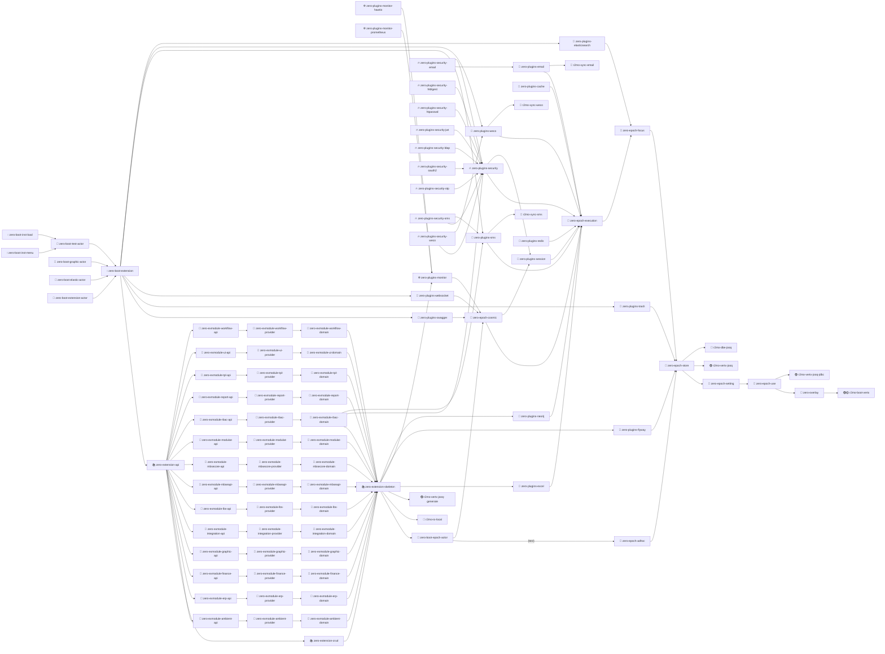

```mermaid
graph LR
  %% R2MO
  r-dbe-jooq[🔵 r2mo-dbe-jooq]
  r-boot-vertx[🟣🟡 r2mo-boot-vertx]
  r-io-local[🔵 r2mo-io-local]
  r-vertx-jooq[🟣 r2mo-vertx-jooq]
  r-vertx-jooq-generate[🟣 r2mo-vertx-jooq-generate]
  r-vertx-jooq-jdbc[🟣 r2mo-vertx-jooq-jdbc]
  r-xync-email[🔵 r2mo-xync-email]
  r-xync-sms[🔵 r2mo-xync-sms]
  r-xync-weco[🔵 r2mo-xync-weco]
  
  %% ZERO
  %% -------------- Core
  z-overlay[🧬 zero-overlay]
  z-epoch-use[🧬 zero-epoch-use]
  z-epoch-setting[🧬 zero-epoch-setting]
  z-epoch-store[🧬 zero-epoch-store]
  z-epoch-focus[🧬 zero-epoch-focus]
  z-epoch-execution[🧬 zero-epoch-execution]
  z-epoch-cosmic[🧬 zero-epoch-cosmic]
  z-epoch-adhoc[🧬 zero-epoch-adhoc]
  %% -------------- Plugins
  z-plugins-cache[🧩 zero-plugins-cache]
  z-plugins-elasticsearch[🧩 zero-plugins-elasticsearch]
  z-plugins-session[🧩 zero-plugins-session]
  z-plugins-email[🧩 zero-plugins-email]
  z-plugins-excel[🧩 zero-plugins-excel]
  z-plugins-flyway[🧩 zero-plugins-flyway]
  z-plugins-monitor[❄️ zero-plugins-monitor]
  z-plugins-monitor-hawtio[❄️ zero-plugins-monitor-hawtio]
  z-plugins-monitor-prometheus[❄️ zero-plugins-monitor-prometheus]
  z-plugins-neo4j[🧩 zero-plugins-neo4j]
  z-plugins-redis[🧩 zero-plugins-redis]
  z-plugins-security[🔥 zero-plugins-security]
  z-plugins-security-email[🔥 zero-plugins-security-email]
  z-plugins-security-htdigest[🔥 zero-plugins-security-htdigest]
  z-plugins-security-htpasswd[🔥 zero-plugins-security-htpasswd]
  z-plugins-security-jwt[🔥 zero-plugins-security-jwt]
  z-plugins-security-ldap[🔥 zero-plugins-security-ldap]
  z-plugins-security-oauth2[🔥 zero-plugins-security-oauth2]
  z-plugins-security-otp[🔥 zero-plugins-security-otp]
  z-plugins-security-sms[🔥 zero-plugins-security-sms]
  z-plugins-security-weco[🔥 zero-plugins-security-weco]
  z-plugins-sms[🧩 zero-plugins-sms]
  z-plugins-swagger[🧩 zero-plugins-swagger]
  z-plugins-trash[🧩 zero-plugins-trash]
  z-plugins-websocket[🧩 zero-plugins-websocket]
  z-plugins-weco[🧩 zero-plugins-weco]
  %% ----------------- Boot
  z-boot-epoch-actor[🪼 zero-boot-epoch-actor]
  %% ----------------- Extension
  z-extension-skeleton[📚️ zero-extension-skeleton]
  z-extension-crud[📚️ zero-extension-crud]
  z-extension-api[📚️ zero-extension-api]
  
  z-exmodule-ambient-domain[🧪 zero-exmodule-ambient-domain]
  z-exmodule-ambient-provider[🧪 zero-exmodule-ambient-provider]
  z-exmodule-ambient-api[🧪 zero-exmodule-ambient-api]
  
  z-exmodule-erp-domain[🧪 zero-exmodule-erp-domain]
  z-exmodule-erp-provider[🧪 zero-exmodule-erp-provider]
  z-exmodule-erp-api[🧪 zero-exmodule-erp-api]
  
  z-exmodule-finance-domain[🧪 zero-exmodule-finance-domain]
  z-exmodule-finance-provider[🧪 zero-exmodule-finance-provider]
  z-exmodule-finance-api[🧪 zero-exmodule-finance-api]
  
  z-exmodule-graphic-domain[🧪 zero-exmodule-graphic-domain]
  z-exmodule-graphic-provider[🧪 zero-exmodule-graphic-provider]
  z-exmodule-graphic-api[🧪 zero-exmodule-graphic-api]
  
  z-exmodule-integration-domain[🧪 zero-exmodule-integration-domain]
  z-exmodule-integration-provider[🧪 zero-exmodule-integration-provider]
  z-exmodule-integration-api[🧪 zero-exmodule-integration-api]
  
  z-exmodule-lbs-domain[🧪 zero-exmodule-lbs-domain]
  z-exmodule-lbs-provider[🧪 zero-exmodule-lbs-provider]
  z-exmodule-lbs-api[🧪 zero-exmodule-lbs-api]
  
  z-exmodule-mbseapi-domain[🧪 zero-exmodule-mbseapi-domain]
  z-exmodule-mbseapi-provider[🧪 zero-exmodule-mbseapi-provider]
  z-exmodule-mbseapi-api[🧪 zero-exmodule-mbseapi-api]
  
  z-exmodule-mbsecore-domain[🧪 zero-exmodule-mbsecore-domain]
  z-exmodule-mbsecore-provider[🧪 zero-exmodule-mbsecore-provider]
  z-exmodule-mbsecore-api[🧪 zero-exmodule-mbsecore-api]
  
  z-exmodule-modulat-domain[🧪 zero-exmodule-modulat-domain]
  z-exmodule-modulat-provider[🧪 zero-exmodule-modulat-provider]
  z-exmodule-modulat-api[🧪 zero-exmodule-modulat-api]
  
  z-exmodule-rbac-domain[🧪 zero-exmodule-rbac-domain]
  z-exmodule-rbac-provider[🧪 zero-exmodule-rbac-provider]
  z-exmodule-rbac-api[🧪 zero-exmodule-rbac-api]
  
  z-exmodule-report-domain[🧪 zero-exmodule-report-domain]
  z-exmodule-report-provider[🧪 zero-exmodule-report-provider]
  z-exmodule-report-api[🧪 zero-exmodule-report-api]
  
  z-exmodule-tpl-domain[🧪 zero-exmodule-tpl-domain]
  z-exmodule-tpl-provider[🧪 zero-exmodule-tpl-provider]
  z-exmodule-tpl-api[🧪 zero-exmodule-tpl-api]
  
  z-exmodule-ui-domain[🧪 zero-exmodule-ui-domain]
  z-exmodule-ui-provider[🧪 zero-exmodule-ui-provider]
  z-exmodule-ui-api[🧪 zero-exmodule-ui-api]
  
  z-exmodule-workflow-domain[🧪 zero-exmodule-workflow-domain]
  z-exmodule-workflow-provider[🧪 zero-exmodule-workflow-provider]
  z-exmodule-workflow-api[🧪 zero-exmodule-workflow-api]
  
  %% ------------------
  z-boot-extension[💧 zero-boot-extension]
  z-boot-test-actor[🪼 zero-boot-test-actor]
  z-boot-graphic-actor[🪼 zero-boot-graphic-actor]
  z-boot-elastic-actor[🪼 zero-boot-elastic-actor]
  z-boot-extension-actor[🪼 zero-boot-extension-actor]
  z-boot-inst-load[💧 zero-boot-inst-load]
  z-boot-inst-menu[💧 zero-boot-inst-menu]
  
  %% ------------------
  z-overlay --> r-boot-vertx
  z-epoch-use --> z-overlay
  z-epoch-use --> r-vertx-jooq-jdbc
  z-epoch-setting --> z-epoch-use
  z-epoch-store --> z-epoch-setting
  z-epoch-store --> r-vertx-jooq & r-dbe-jooq
  z-epoch-focus --> z-epoch-store
  z-epoch-execution --> z-epoch-focus
  z-epoch-cosmic --> z-epoch-execution & z-plugins-session
  z-epoch-adhoc --> z-epoch-store
  
  %% ------------------
  z-plugins-cache --> z-epoch-execution
  z-plugins-elasticsearch --> z-epoch-focus
  z-plugins-email --> z-epoch-execution & r-xync-email
  z-plugins-excel --> z-epoch-execution
  z-plugins-flyway --> z-epoch-store
  z-plugins-monitor --> z-epoch-cosmic
  z-plugins-monitor-hawtio --> z-plugins-monitor
  z-plugins-monitor-prometheus --> z-plugins-monitor
  z-plugins-neo4j --> z-epoch-execution
  z-plugins-redis --> z-epoch-execution
  z-plugins-security --> z-epoch-execution & z-plugins-session
  z-plugins-security-email --> z-plugins-email
  z-plugins-security-email --> z-plugins-security
  z-plugins-security-htdigest --> z-plugins-security
  z-plugins-security-htpasswd --> z-plugins-security
  z-plugins-security-jwt --> z-plugins-security
  z-plugins-security-ldap --> z-plugins-security
  z-plugins-security-oauth2 --> z-plugins-security
  z-plugins-security-otp --> z-plugins-security
  z-plugins-security-sms --> z-plugins-security & z-plugins-sms
  z-plugins-security-weco --> z-plugins-security & z-plugins-weco
  z-plugins-session --> z-epoch-execution
  z-plugins-sms --> z-epoch-execution & r-xync-sms
  z-plugins-swagger --> z-epoch-cosmic
  z-plugins-trash --> z-epoch-store
  z-plugins-websocket --> z-epoch-cosmic
  z-plugins-weco --> z-epoch-execution & r-xync-weco
  
  
  z-boot-epoch-actor -- (test) --> z-epoch-adhoc
  z-boot-epoch-actor --> z-epoch-cosmic
  
  
  z-extension-skeleton --> z-boot-epoch-actor
  z-extension-skeleton --> r-io-local & r-vertx-jooq-generate
  z-extension-skeleton --> z-plugins-excel & z-plugins-monitor & z-plugins-flyway & z-plugins-neo4j
  
  
  z-exmodule-ambient-api --> z-exmodule-ambient-provider --> z-exmodule-ambient-domain --> z-extension-skeleton
  z-exmodule-erp-api --> z-exmodule-erp-provider --> z-exmodule-erp-domain --> z-extension-skeleton
  z-exmodule-finance-api --> z-exmodule-finance-provider --> z-exmodule-finance-domain --> z-extension-skeleton
  z-exmodule-graphic-api --> z-exmodule-graphic-provider --> z-exmodule-graphic-domain --> z-extension-skeleton
  z-exmodule-integration-api --> z-exmodule-integration-provider --> z-exmodule-integration-domain --> z-extension-skeleton
  z-exmodule-lbs-api --> z-exmodule-lbs-provider --> z-exmodule-lbs-domain --> z-extension-skeleton
  z-exmodule-mbseapi-api --> z-exmodule-mbseapi-provider --> z-exmodule-mbseapi-domain --> z-extension-skeleton
  z-exmodule-mbsecore-api --> z-exmodule-mbsecore-provider --> z-exmodule-mbsecore-domain --> z-extension-skeleton
  z-exmodule-modulat-api --> z-exmodule-modulat-provider --> z-exmodule-modulat-domain --> z-extension-skeleton
  z-exmodule-rbac-api --> z-exmodule-rbac-provider --> z-exmodule-rbac-domain --> z-extension-skeleton
  z-exmodule-rbac-domain --> z-plugins-security & z-plugins-sms
  z-exmodule-report-api --> z-exmodule-report-provider --> z-exmodule-report-domain --> z-extension-skeleton
  z-exmodule-tpl-api --> z-exmodule-tpl-provider --> z-exmodule-tpl-domain --> z-extension-skeleton
  z-exmodule-ui-api --> z-exmodule-ui-provider --> z-exmodule-ui-domain --> z-extension-skeleton
  z-exmodule-workflow-api --> z-exmodule-workflow-provider --> z-exmodule-workflow-domain --> z-extension-skeleton
  
  z-extension-crud --> z-extension-skeleton
  
  z-extension-api --> z-extension-crud
  z-extension-api --> z-exmodule-ambient-api & z-exmodule-erp-api & z-exmodule-finance-api & z-exmodule-graphic-api 
  z-extension-api --> z-exmodule-integration-api & z-exmodule-lbs-api & z-exmodule-mbseapi-api & z-exmodule-mbsecore-api 
  z-extension-api --> z-exmodule-modulat-api & z-exmodule-rbac-api & z-exmodule-report-api & z-exmodule-tpl-api 
  z-extension-api --> z-exmodule-ui-api & z-exmodule-workflow-api
  
  z-boot-extension --> z-extension-api
  z-boot-extension --> z-plugins-swagger & z-plugins-trash & z-plugins-websocket
  z-boot-extension --> z-plugins-sms & z-plugins-weco & z-plugins-elasticsearch
  
  z-boot-test-actor --> z-boot-extension
  z-boot-graphic-actor --> z-boot-extension
  z-boot-elastic-actor --> z-boot-extension
  z-boot-extension-actor --> z-boot-extension
  z-boot-inst-menu --> z-boot-test-actor
  z-boot-inst-load --> z-boot-test-actor
```