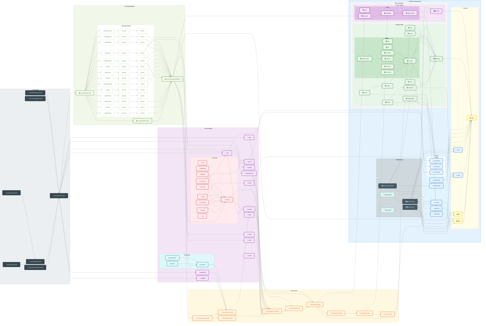

```mermaid
%%{init: {
  'theme': 'base',
  'themeVariables': { 'fontSize': '13px', 'fontFamily': 'arial', 'darkMode': false },
  'flowchart': { 
    'diagramPadding': 5, 
    'nodeSpacing': 10, 
    'rankSpacing': 40, 
    'curve': 'basis', 
    'useMaxWidth': true
  }
} }%%
graph LR
    %% =========================================================================
    %% [全局样式库]
    %% =========================================================================
    linkStyle default interpolate basis stroke:#999,stroke-width:1px
    
    %% --- Zero 体系样式 ---
    classDef z_boot fill:#37474f,stroke:#263238,stroke-width:2px,rx:4,ry:4,color:#fff
    classDef z_ext fill:#f1f8e9,stroke:#558b2f,stroke-width:2px,rx:4,ry:4,color:#33691e
    classDef z_plugin fill:#f3e5f5,stroke:#8e24aa,stroke-width:2px,rx:4,ry:4,color:#4a148c
    classDef z_core fill:#fff3e0,stroke:#ef6c00,stroke-width:2px,rx:4,ry:4,color:#e65100
    classDef z_mod_api fill:#fff,stroke:#7cb342,stroke-width:1px,rx:3,ry:3,color:#33691e,stroke-dasharray: 2 2
    classDef z_mod_node fill:#fff,stroke:#aed581,stroke-width:1px,rx:3,ry:3,color:#558b2f
    classDef z_sec fill:#ffebee,stroke:#c62828,stroke-width:2px,rx:4,ry:4,color:#b71c1c
    classDef z_mon fill:#e0f7fa,stroke:#00838f,stroke-width:2px,rx:4,ry:4,color:#006064

    %% --- R2MO 体系样式 ---
    classDef r_boot fill:#455a64,stroke:#263238,stroke-width:2px,rx:4,ry:4,color:#fff
    classDef r_spring fill:#e8f5e9,stroke:#2e7d32,stroke-width:2px,rx:4,ry:4,color:#1b5e20
    classDef r_vertx fill:#f3e5f5,stroke:#7b1fa2,stroke-width:2px,rx:4,ry:4,color:#4a148c
    classDef r_impl fill:#e3f2fd,stroke:#1565c0,stroke-width:2px,rx:4,ry:4,color:#0d47a1
    classDef r_kernel fill:#fff9c4,stroke:#fbc02d,stroke-width:2px,rx:4,ry:4,color:#333
    classDef r_test fill:#e0f2f1,stroke:#009688,stroke-width:2px,rx:4,ry:4,stroke-dasharray: 5,5,color:#004d40

    %% #########################################################################
    %% [PART 1: ZERO FRAMEWORK] (左侧业务应用域)
    %% #########################################################################

    %% --- 1.1 Zero Boot ---
    subgraph Z_Boot ["🚀 Zero Boot"]
        direction TB
        z-boot-extension["💧 zero-boot-extension"]:::z_boot
        z-boot-extension-actor["🪼 zero-boot-extension-actor"]:::z_boot
        z-boot-test-actor["🪼 zero-boot-test-actor"]:::z_boot
        z-boot-graphic-actor["🪼 zero-boot-graphic-actor"]:::z_boot
        z-boot-elastic-actor["🪼 zero-boot-elastic-actor"]:::z_boot
        z-boot-inst-load["💧 zero-boot-inst-load"]:::z_boot
        z-boot-inst-menu["💧 zero-boot-inst-menu"]:::z_boot
    end

    %% --- 1.2 Zero Extensions ---
    subgraph Z_Extension ["🌿 Domain Modules"]
        direction TB
        z-extension-api["📚️ zero-extension-api"]:::z_ext
        z-extension-crud["📚️ zero-extension-crud"]:::z_ext
        
        subgraph Matrix_Modules ["🧪 Modules Matrix"]
            direction TB
            %% Core
            za_a["🧪 ambient-api"]:::z_mod_api --> za_p["provider"]:::z_mod_node --> za_d["domain"]:::z_mod_node
            ze_a["🧪 erp-api"]:::z_mod_api --> ze_p["provider"]:::z_mod_node --> ze_d["domain"]:::z_mod_node
            zf_a["🧪 finance-api"]:::z_mod_api --> zf_p["provider"]:::z_mod_node --> zf_d["domain"]:::z_mod_node
            zr_a["🧪 rbac-api"]:::z_mod_api --> zr_p["provider"]:::z_mod_node --> zr_d["domain"]:::z_mod_node
            %% Features
            zg_a["🧪 graphic-api"]:::z_mod_api --> zg_p["provider"]:::z_mod_node --> zg_d["domain"]:::z_mod_node
            zu_a["🧪 ui-api"]:::z_mod_api --> zu_p["provider"]:::z_mod_node --> zu_d["domain"]:::z_mod_node
            zi_a["🧪 integration-api"]:::z_mod_api --> zi_p["provider"]:::z_mod_node --> zi_d["domain"]:::z_mod_node
            zl_a["🧪 lbs-api"]:::z_mod_api --> zl_p["provider"]:::z_mod_node --> zl_d["domain"]:::z_mod_node
            %% System
            zrep_a["🧪 report-api"]:::z_mod_api --> zrep_p["provider"]:::z_mod_node --> zrep_d["domain"]:::z_mod_node
            ztpl_a["🧪 tpl-api"]:::z_mod_api --> ztpl_p["provider"]:::z_mod_node --> ztpl_d["domain"]:::z_mod_node
            zwf_a["🧪 workflow-api"]:::z_mod_api --> zwf_p["provider"]:::z_mod_node --> zwf_d["domain"]:::z_mod_node
            zmd_a["🧪 modulat-api"]:::z_mod_api --> zmd_p["provider"]:::z_mod_node --> zmd_d["domain"]:::z_mod_node
            %% MBSE
            zma_a["🧪 mbseapi-api"]:::z_mod_api --> zma_p["provider"]:::z_mod_node --> zma_d["domain"]:::z_mod_node
            zmc_a["🧪 mbsecore-api"]:::z_mod_api --> zmc_p["provider"]:::z_mod_node --> zmc_d["domain"]:::z_mod_node
        end
        z-extension-skeleton["📚️ zero-extension-skeleton"]:::z_ext
    end

    %% --- 1.3 Zero Plugins ---
    subgraph Z_Plugins ["🧩 Zero Plugins"]
        direction TB
        %% Standard
        z-plugins-cache["🧩 cache"]:::z_plugin
        z-plugins-session["🧩 session"]:::z_plugin
        z-plugins-flyway["🧩 flyway"]:::z_plugin
        z-plugins-excel["🧩 excel"]:::z_plugin
        z-plugins-redis["🧩 redis"]:::z_plugin
        z-plugins-elasticsearch["🧩 elasticsearch"]:::z_plugin
        z-plugins-neo4j["🧩 neo4j"]:::z_plugin
        z-plugins-trash["🧩 trash"]:::z_plugin
        z-plugins-swagger["🧩 swagger"]:::z_plugin
        z-plugins-websocket["🧩 websocket"]:::z_plugin
        %% Comms
        z-plugins-email["🧩 email"]:::z_plugin
        z-plugins-sms["🧩 sms"]:::z_plugin
        z-plugins-weco["🧩 weco"]:::z_plugin
        %% Groups
        subgraph Box_Sec ["🔥 Security"]
            z-plugins-security["🔥 security"]:::z_sec
            z-plugins-security-email["🔥 sec-email"]:::z_sec
            z-plugins-security-sms["🔥 sec-sms"]:::z_sec
            z-plugins-security-weco["🔥 sec-weco"]:::z_sec
            z-plugins-security-jwt["🔥 jwt"]:::z_sec
            z-plugins-security-oauth2["🔥 oauth2"]:::z_sec
            z-plugins-security-ldap["🔥 ldap"]:::z_sec
            z-plugins-security-htdigest["🔥 htdigest"]:::z_sec
            z-plugins-security-htpasswd["🔥 htpasswd"]:::z_sec
            z-plugins-security-otp["🔥 otp"]:::z_sec
        end
        subgraph Box_Mon ["❄️ Monitor"]
            z-plugins-monitor["❄️ monitor"]:::z_mon
            z-plugins-monitor-hawtio["❄️ hawtio"]:::z_mon
            z-plugins-monitor-prometheus["❄️ prometheus"]:::z_mon
        end
    end

    %% --- 1.4 Zero Core ---
    subgraph Z_Core ["👑 Zero Core"]
        direction TB
        z-overlay["🧬 zero-overlay"]:::z_core
        z-epoch-use["🧬 zero-epoch-use"]:::z_core
        z-epoch-setting["🧬 zero-epoch-setting"]:::z_core
        z-epoch-store["🧬 zero-epoch-store"]:::z_core
        z-epoch-focus["🧬 zero-epoch-focus"]:::z_core
        z-epoch-execution["🧬 zero-epoch-execution"]:::z_core
        z-epoch-cosmic["🧬 zero-epoch-cosmic"]:::z_core
        z-epoch-adhoc["🧬 zero-epoch-adhoc"]:::z_core
        z-boot-epoch-actor["🪼 zero-boot-epoch-actor"]:::z_core
    end

    %% #########################################################################
    %% [PART 2: R2MO FRAMEWORK] (右侧基础设施域)
    %% #########################################################################
    subgraph Zone_R2MO_Infra ["🔷 R2MO Infrastructure"]
        direction LR 
        
        %% --- 2.1 R2MO Boot ---
        subgraph R_Boot ["🚀 R2MO Boot"]
            direction TB
            r-boot-spring-default["🟢 boot-spring-default"]:::r_boot
            r-boot-spring["🟢🟡 boot-spring"]:::r_boot
            r-boot-vertx["🟣🟡 boot-vertx"]:::r_boot
            r-spring-junit5["🧪 spring-junit5"]:::r_test
            r-vertx-junit5["🧪 vertx-junit5"]:::r_test
        end

        %% --- 2.2 R2MO Framework (Spring & Vertx Stack) ---
        subgraph R_Framework ["🛠 Ecosystems"]
            direction TB
            
            subgraph Box_Spring ["🍃 Spring Stack"]
                direction TB
                r-spring["🟢🟡 spring"]:::r_spring
                %% Sec Group
                subgraph Box_SpringSec ["🔒 Sec"]
                    r-spring-security["🟢 security"]:::r_spring
                    r-spring-security-oauth2client["🟢 oauth2-client"]:::r_spring
                    r-spring-security-oauth2["🟢 oauth2"]:::r_spring
                    r-spring-security-jwt["🟢 jwt"]:::r_spring
                    r-spring-security-ldap["🟢 ldap"]:::r_spring
                    r-spring-security-email["🟢 sec-email"]:::r_spring
                    r-spring-security-sms["🟢 sec-sms"]:::r_spring
                    r-spring-security-weco["🟢 sec-weco"]:::r_spring
                end
                %% Utils
                r-spring-mybatisplus["🟢 mybatisplus"]:::r_spring
                r-spring-template["🟢 template"]:::r_spring
                r-spring-excel["🟢 excel"]:::r_spring
                r-spring-json["🟢 json"]:::r_spring
                r-spring-cache["🟢 cache"]:::r_spring
                r-spring-email["🟢 email"]:::r_spring
                r-spring-sms["🟢 sms"]:::r_spring
                r-spring-weco["🟢 weco"]:::r_spring
            end

            subgraph Box_Vertx ["⚛️ Vert.x Stack"]
                direction TB
                r-vertx["🟣🟡 vertx"]:::r_vertx
                subgraph Box_Jooq ["🔮 Jooq"]
                    r-vertx-jooq["🟣 jooq"]:::r_vertx
                    r-vertx-jooq-generate["🟣 jooq-gen"]:::r_vertx
                    r-vertx-jooq-jdbc["🟣 jooq-jdbc"]:::r_vertx
                    r-vertx-jooq-shared["🟣 jooq-shared"]:::r_vertx
                end
            end
        end

        %% --- 2.3 R2MO Impl ---
        subgraph R_Impl ["🔧 Impl"]
            direction TB
            r-dbe-jooq["🔵 dbe-jooq"]:::r_impl
            r-dbe-mybatisplus["🔵 dbe-mp"]:::r_impl
            r-io-local["🔵 io-local"]:::r_impl
            r-typed-hutool["🔵 typed-hutool"]:::r_impl
            r-typed-vertx["🔵 typed-vertx"]:::r_impl
            subgraph Box_Xync ["⚡ Xync"]
                r-xync-email["🔵 xync-email"]:::r_impl
                r-xync-sms["🔵 xync-sms"]:::r_impl
                r-xync-weco["🔵 xync-weco"]:::r_impl
            end
        end

        %% --- 2.4 R2MO Kernel ---
        subgraph R_Kernel ["👑 Kernel"]
            direction TB
            r-ams["🟡 ams"]:::r_kernel
            r-dbe["🟡 dbe"]:::r_kernel
            r-io["🟡 io"]:::r_kernel
            r-jaas["🔵 jaas"]:::r_impl
            r-jce["🔵 jce"]:::r_impl
        end
    end

    %% #########################################################################
    %% [PART 3: GLOBAL CONNECTIONS] (连线逻辑)
    %% #########################################################################

    %% === Zero Internal ===
    z-boot-extension --> z-extension-api
    z-boot-extension --> z-plugins-swagger & z-plugins-trash & z-plugins-websocket & z-plugins-sms & z-plugins-weco & z-plugins-elasticsearch
    z-boot-extension-actor & z-boot-test-actor & z-boot-graphic-actor & z-boot-elastic-actor --> z-boot-extension
    z-boot-inst-load & z-boot-inst-menu --> z-boot-test-actor
    z-extension-api --> z-extension-crud --> z-extension-skeleton
    z-extension-api --> za_a & ze_a & zf_a & zr_a & zg_a & zu_a & zi_a & zl_a & zrep_a & ztpl_a & zwf_a & zmd_a & zma_a & zmc_a
    za_d & ze_d & zf_d & zr_d & zg_d & zu_d & zi_d & zl_d & zrep_d & ztpl_d & zwf_d & zmd_d & zma_d & zmc_d --> z-extension-skeleton
    zr_d --> z-plugins-security & z-plugins-sms
    z-extension-skeleton --> z-boot-epoch-actor
    z-extension-skeleton --> z-plugins-excel & z-plugins-monitor & z-plugins-flyway & z-plugins-neo4j
    z-boot-epoch-actor --> z-epoch-cosmic & z-epoch-adhoc
    z-epoch-cosmic --> z-epoch-execution & z-plugins-session
    z-epoch-execution --> z-epoch-focus --> z-epoch-store --> z-epoch-setting --> z-epoch-use --> z-overlay
    z-plugins-cache & z-plugins-excel & z-plugins-neo4j & z-plugins-redis & z-plugins-session --> z-epoch-execution
    z-plugins-elasticsearch --> z-epoch-focus
    z-plugins-flyway & z-plugins-trash --> z-epoch-store
    z-plugins-swagger & z-plugins-websocket & z-plugins-monitor --> z-epoch-cosmic
    z-plugins-monitor-hawtio & z-plugins-monitor-prometheus --> z-plugins-monitor
    z-plugins-email --> z-epoch-execution
    z-plugins-sms --> z-epoch-execution
    z-plugins-weco --> z-epoch-execution
    z-plugins-security --> z-epoch-execution & z-plugins-session
    z-plugins-security-email --> z-plugins-email & z-plugins-security
    z-plugins-security-sms --> z-plugins-sms & z-plugins-security
    z-plugins-security-weco --> z-plugins-weco & z-plugins-security
    z-plugins-security-jwt & z-plugins-security-oauth2 & z-plugins-security-ldap & z-plugins-security-htdigest & z-plugins-security-htpasswd & z-plugins-security-otp --> z-plugins-security

    %% === R2MO Internal (Condensed) ===
    r-dbe --> r-ams
    r-io --> r-ams
    r-jaas & r-jce --> r-ams
    r-dbe-jooq & r-dbe-mybatisplus --> r-dbe
    r-io-local --> r-io
    r-typed-hutool & r-typed-vertx --> r-ams
    r-xync-email & r-xync-sms & r-xync-weco --> r-ams
    r-spring --> r-ams
    r-spring-mybatisplus & r-spring-template & r-spring-excel & r-spring-json --> r-spring
    r-spring-mybatisplus --> r-dbe-mybatisplus
    r-spring-email --> r-spring-template & r-xync-email
    r-spring-sms --> r-spring & r-xync-sms
    r-spring-weco --> r-spring-cache & r-xync-weco
    r-spring-security --> r-spring & r-jaas
    r-spring-cache --> r-spring-security
    r-spring-security-email & r-spring-security-sms & r-spring-security-weco --> r-spring-security
    r-spring-security-jwt & r-spring-security-ldap --> r-spring-security
    r-spring-security-oauth2client --> r-spring-security-oauth2 --> r-spring-security & r-spring-template
    r-vertx --> r-ams
    r-vertx-jooq-generate --> r-vertx-jooq-jdbc --> r-vertx-jooq-shared --> r-vertx & r-dbe-jooq
    r-vertx-jooq --> r-vertx-jooq-jdbc
    r-boot-vertx --> r-dbe & r-io & r-jce & r-jaas & r-vertx
    r-boot-spring --> r-dbe & r-io & r-jce & r-jaas & r-spring
    r-boot-spring-default --> r-boot-spring & r-spring-mybatisplus & r-spring-json & r-typed-hutool & r-io-local
    r-vertx-junit5 -.-> r-boot-vertx
    r-spring-junit5 -.-> r-boot-spring & r-dbe-mybatisplus

    %% === CROSS-SYSTEM CONNECTIONS (关键：缝合两张图) ===
    z-extension-skeleton --> r-io-local & r-vertx-jooq-generate
    z-epoch-store --> r-vertx-jooq & r-dbe-jooq
    z-overlay --> r-boot-vertx
    z-epoch-use --> r-vertx-jooq-jdbc
    z-plugins-email --> r-xync-email
    z-plugins-sms --> r-xync-sms
    z-plugins-weco --> r-xync-weco

    %% =========================================================================
    %% [背景上色]
    %% =========================================================================
    style Z_Boot fill:#eceff1,stroke:#cfd8dc,stroke-width:2px
    style Z_Extension fill:#f1f8e9,stroke:#c8e6c9,stroke-width:2px
    style Z_Plugins fill:#f3e5f5,stroke:#e1bee7,stroke-width:2px
    style Z_Core fill:#fff8e1,stroke:#ffe0b2,stroke-width:2px
    
    style Zone_R2MO_Infra fill:#e3f2fd,stroke:#90caf9,stroke-width:2px
    style R_Boot fill:#cfd8dc,stroke:#b0bec5,stroke-width:2px
    style R_Framework fill:#f5f5f5,stroke:#e0e0e0,stroke-width:1px
    style R_Impl fill:#e1f5fe,stroke:#b3e5fc,stroke-width:1px
    style R_Kernel fill:#fffde7,stroke:#fff9c4,stroke-width:1px

    style Matrix_Modules fill:#ffffff,stroke:#dcedc8,stroke-width:2px,stroke-dasharray: 5 5
    style Box_Sec fill:#ffebee,stroke:#ffcdd2,stroke-width:2px
    style Box_Mon fill:#e0f7fa,stroke:#b2ebf2,stroke-width:2px
    
    style Box_Spring fill:#e8f5e9,stroke:none
    style Box_SpringSec fill:#c8e6c9,stroke:none
    style Box_Vertx fill:#f3e5f5,stroke:none
    style Box_Jooq fill:#e1bee7,stroke:none
    style Box_Xync fill:#ffffff,stroke:#90caf9,stroke-dasharray: 5 5
```