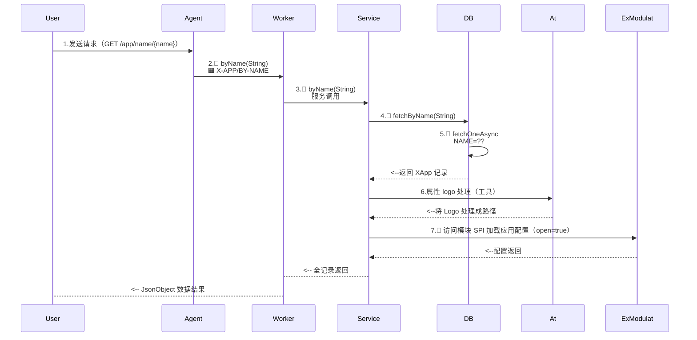
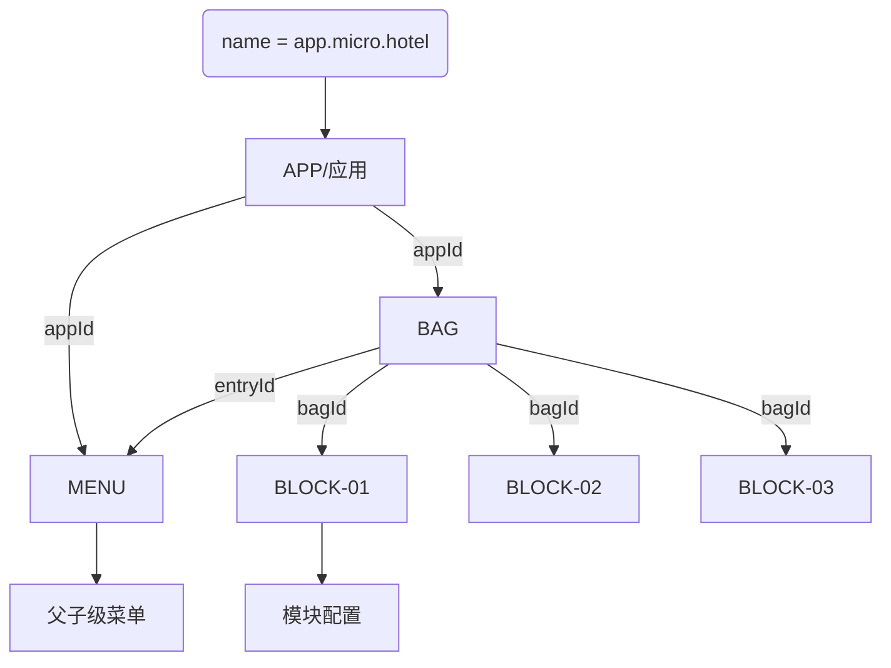

## 请求流程

## 特殊说明

### 接口基础

- 相关数据表：`X_APP / X_TENANT`
- 此接口用于访问应用配置，应用程序的访问主要包含两种
	- **公开访问**：未登录的场景下可直接提取应用基本信息，此时使用应用标识 `X-App-Id / appId`
	- **加密访问**：登录场景下直接访问，应用标识追加 `X-App-Key / appKey`，这种模式可以访问敏感数据
- `X_APP` 属性说明
	- 独立应用：启动过程中的 `Z_APP` 在发布时会从环境变量中加载，启动之后它所对应的应用记录作为应用入口。
	- 微服务：启动过程中的 `Z_APP` 作为主应用，启动之后作为主入口。

### 接口扩展

- 启用了模块化功能之后 `zero-exmodule-modulat`，应用的配置信息回存储在 `B_BAG / B_BLOCK` 两张表中，此处双表进行应用、模块的配置访问，也方便后台对这些配置进行管理。
- 模块化中 `B_BAG` 属性包含两种：
	- 主模块：入口模块
	- 子模块：普通模块

### 结构说明

