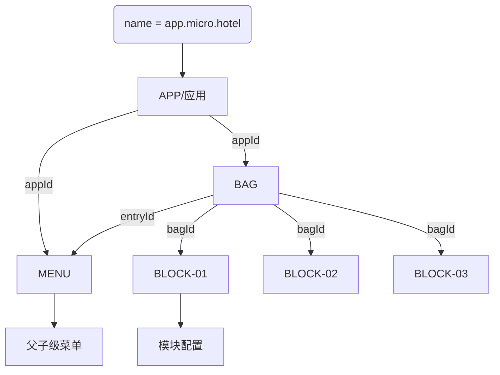

```mermaid
graph TD;
   Z_APP(name = app.micro.hotel) --> APP/应用
   %% 应用分流
   APP/应用 -- appId --> MENU
   APP/应用 -- appId --> BAG -- entryId --> MENU
   
   %% 模块分流
   BAG -- bagId --> BLOCK-01
   BAG -- bagId --> BLOCK-02
   BAG -- bagId --> BLOCK-03
   
   BLOCK-01 --> 模块配置
   
   MENU --> 父子级菜单
```